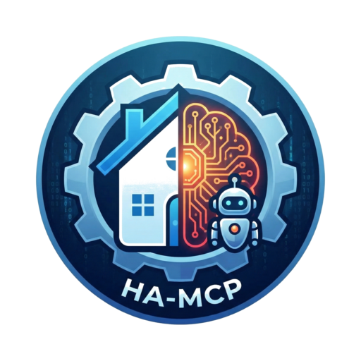

<div align="center">



# Home Assistant MCP Server

[](https://github.com/itsmrshow/home-assistant-mcp-server)
[](LICENSE)
[](https://hub.docker.com/r/itsmrshow/home-assistant-mcp-server)
[](https://hub.docker.com/r/itsmrshow/home-assistant-mcp-server)
[](https://github.com/itsmrshow/home-assistant-mcp-server/pkgs/container/home-assistant-mcp-server)

**A standalone MCP (Model Context Protocol) server that enables AI assistants to interact with Home Assistant** 🏠🤖

</div>

> **Note:** This is a fork of [home-assistant-cursor-agent](https://github.com/Coolver/home-assistant-cursor-agent) by Coolver, adapted to work as a standalone Docker container with any Home Assistant installation (not just Home Assistant OS) and any AI client that supports the MCP protocol (not just Cursor).

---

## 🎯 What is this?

**Home Assistant MCP Server** is a standalone FastAPI server that provides a REST API enabling AI assistants to interact with Home Assistant through the Model Context Protocol (MCP). It works with:

- ✅ **Any Home Assistant installation:** Home Assistant Container, Core, Supervised, or OS
- ✅ **Any AI client:** Cursor, VS Code + Copilot, Claude Desktop, or any MCP-compatible client
- ✅ **Dockerized Home Assistant:** Specifically designed for containerized deployments

Let AI build your Home Assistant automations — or act as your DevOps for the ones you write by hand. Just describe what you need in natural language.

Transform the way you manage your smart home. This server enables **Cursor**, **Visual Studio Code (VS Code)**, **Claude Desktop**, or any **MCP-enabled IDE** to:

- 📝 Analyze your Home Assistant configuration, entities, and devices
- 🏗️ Create intelligent automations, scripts, and complete systems — including Home Assistant helpers that can be fully managed programmatically
- 🎨 Design and customize Lovelace dashboards with full control over cards, layouts, and styling
- 🖌️ Create and tweak themes for a personalized UI
- 🔄 Safely deploy changes with automatic Git-based versioning
- 🔍 Monitor and troubleshoot your setup through log analysis
- 📦 Install and manage HACS integrations and custom repositories

---

### 🔍 Analyze your setup

✅ Read your full configuration — entities, automations, scripts, helpers
✅ Understand your devices — capabilities, relations, and usage patterns
✅ Learn existing logic — analyze how your current automations and scripts behave

---

### 🏗️ Build intelligence

✅ Create complete systems — multiple interconnected automations in seconds
✅ Generate helpers and sensors — tailored to your actual setup and needs
✅ Write optimized scripts — based on real entities, areas, and devices
✅ Refactor existing logic — improve or merge automations instead of starting from scratch

---

### 📊 Dashboards & UI

✅ Create and update Lovelace dashboards — fully programmatically
✅ Add, remove, or rearrange cards — stat, graphs, history, custom cards, and more
✅ Control layouts and views — organize rooms, areas, and scenarios
✅ Design and tweak themes — colors, typography, and styles for a personalized UI

---

### 🔒 Safe operations

✅ Git-based versioning — every change is tracked with meaningful commit messages
✅ Human-readable commits — AI explains *what* changed and *why*
✅ Configuration validation — test before apply to reduce breaking changes
✅ One-click rollback — revert to a previous state if something goes wrong
✅ Activity log — full audit trail of what the agent did and when

---

### 📦 Extend with the community

✅ Install and configure HACS — unlock 1000+ community integrations
✅ Search repositories — themes, plugins, custom components, dashboards
✅ Install integrations — one-command setup for new HACS components
✅ Keep things fresh — update all HACS repositories from a single place

---

## 🌟 Key Features

### 🏠 Home Assistant Integration
- Full REST API and WebSocket access
- List all entities and their states
- Call any Home Assistant service
- Reload components (automations, scripts, templates)
- Configuration validation
- Real-time state monitoring

### 📦 HACS Integration
**Complete HACS management via WebSocket:**
- Install HACS automatically from GitHub
- Search repositories by name, author, or category
- Install integrations, themes, and plugins
- Update all installed repositories
- View repository details (stars, versions, authors)

### 🔧 Component Management
- Create/Update/Delete Automations (via REST API)
- Create/Update/Delete Scripts (via REST API)
- Create/Delete Input Helpers (boolean, text, number, datetime, select)
- Automatic reload after changes

### 🗂️ Registry Management
- Entity Registry — list, update, and remove entities
- Area Registry — create, update, and delete areas
- Device Registry — list and manage devices
- Dead entity detection — find orphaned entities

### 📁 File Management
- List, read, write, append, delete files
- Automatic backup before modifications
- YAML parsing and validation
- Safe path handling (restricted to `/config`)

### 💾 Git Versioning
- Automatic commit on every change
- Backup history (up to 50 commits)
- Rollback to any previous state
- View diffs between versions
- Meaningful commit messages

### 📊 Monitoring & Troubleshooting
- Server logs API with filtering
- Operation history tracking
- Real-time status monitoring
- Health check endpoint

---

## ⚡ Quick Start

### Docker Images Available

The server is available as pre-built Docker images:
- **Docker Hub:** `itsmrshow/home-assistant-mcp-server:latest`
- **GitHub Container Registry:** `ghcr.io/itsmrshow/home-assistant-mcp-server:latest`

**Supported Platforms:**
- `linux/amd64` (Intel/AMD 64-bit)
- `linux/arm64` (ARM 64-bit - Raspberry Pi 4, Apple Silicon, etc.)
- `linux/arm/v7` (ARM 32-bit - Raspberry Pi 3, etc.)

### Prerequisites

- Docker and Docker Compose installed
- Home Assistant running (any installation type)
- A Home Assistant Long-Lived Access Token

### 1. Get a Home Assistant Long-Lived Access Token

1. Open your Home Assistant UI
2. Go to your profile (click your username in the sidebar)
3. Scroll down to "Long-Lived Access Tokens"
4. Click "Create Token"
5. Give it a name (e.g., "MCP Server")
6. Copy the token (you won't see it again!)

### 2. Choose Your Installation Method

#### Option A: Using Pre-built Docker Image (Recommended)

```bash
# Clone this repository
git clone https://github.com/itsmrshow/home-assistant-mcp-server.git
cd home-assistant-mcp-server

# Copy environment template
cp .env.example .env

# Edit .env file with your details
nano .env
```

Edit `.env` and set:
```bash
HA_URL=http://YOUR_HOME_ASSISTANT_IP:8123
HA_TOKEN=your_long_lived_access_token_here
HA_AGENT_KEY=  # Leave empty to auto-generate, or set your own
```

**Important:** Replace `YOUR_HOME_ASSISTANT_IP` with:
- Your Home Assistant's IP address (e.g., `http://192.168.1.100:8123`)
- Or `http://homeassistant.local:8123` if mDNS is working on your network
- Or `http://host.docker.internal:8123` if HA is on the same machine

Then start it:
```bash
docker-compose up -d
```

The default `docker-compose.yml` uses the pre-built image from Docker Hub.

#### Option B: Build from Source

If you want to build the image yourself:

```bash
# Clone this repository
git clone https://github.com/itsmrshow/home-assistant-mcp-server.git
cd home-assistant-mcp-server

# Copy environment template
cp .env.example .env

# Edit .env file with your details
nano .env
```

Edit `.env` and set:
```bash
HA_URL=http://YOUR_HOME_ASSISTANT_IP:8123
HA_TOKEN=your_long_lived_access_token_here
HA_AGENT_KEY=  # Leave empty to auto-generate, or set your own
```

Then build and start:
```bash
# Build from source
docker-compose -f docker/docker-compose.build.yml up -d --build

# View logs
docker-compose -f docker/docker-compose.build.yml logs -f
```

### 3. Start the Server

```bash
# Start with Docker Compose (using pre-built image)
docker-compose up -d

# View logs
docker-compose logs -f

# Check health
curl http://localhost:8099/api/health
```

The server will:
- Start on port 8099
- Auto-generate an API key if not provided
- Display the API key in the logs
- Save it to `config/.ha_mcp_server_key`
- **Generate MCP client configuration files:**
  - `config/mcp_client_config.json` - Ready-to-use MCP config
  - `config/MCP_CLIENT_SETUP.md` - Complete setup instructions

### 4. Configure Your MCP Client

**The server automatically generates configuration files for you!**

After the server starts, check the `config/` directory for:
- **`MCP_CLIENT_SETUP.md`** - Complete setup instructions for all AI clients
- **`mcp_client_config.json`** - Ready-to-use configuration with your API key

#### Quick Setup for Cursor

1. Copy the contents from `config/mcp_client_config.json`
2. Paste into `~/.cursor/mcp.json`
3. Restart Cursor

#### Quick Setup for VS Code + Copilot

1. Copy the contents from `config/mcp_client_config.json`
2. Paste into your VS Code MCP settings
3. Restart VS Code

#### Quick Setup for Claude Desktop

1. Copy the contents from `config/mcp_client_config.json`
2. Paste into:
   - **macOS:** `~/Library/Application Support/Claude/claude_desktop_config.json`
   - **Windows:** `%APPDATA%\Claude\claude_desktop_config.json`
   - **Linux:** `~/.config/Claude/claude_desktop_config.json`
3. Restart Claude Desktop

**Manual Configuration:**
If you prefer to manually configure, the files are in:
- **API Key:** `config/.ha_mcp_server_key`
- **Or check logs:** `docker-compose logs | grep "API Key"`

### 5. Test It!

Restart your AI client and try:
- "List my Home Assistant entities"
- "Show me all my lights"
- "Create an automation to turn on lights at sunset"

---

## 🔧 Configuration

### Environment Variables

| Variable | Description | Default | Required |
|----------|-------------|---------|----------|
| `HA_URL` | Home Assistant URL | `http://homeassistant.local:8123` | Yes |
| `HA_TOKEN` | Long-Lived Access Token | - | Yes |
| `HA_AGENT_KEY` | API key for MCP clients | Auto-generated | No |
| `PORT` | Server port | `8099` | No |
| `LOG_LEVEL` | Logging level | `info` | No |
| `ENABLE_GIT` | Enable git versioning | `true` | No |
| `AUTO_BACKUP` | Auto backup on changes | `true` | No |
| `MAX_BACKUPS` | Maximum git commits | `50` | No |
| `CONFIG_PATH` | Config storage path | `/config` | No |

### Docker Compose Options

The `docker-compose.yml` allows you to:
- Change the exposed port (default: 8099)
- Mount your Home Assistant config for direct file access
- Adjust git versioning settings
- Configure logging levels

---

## 📚 API Documentation

Once running, visit:
- **Interactive Swagger Docs:** http://localhost:8099/docs
- **ReDoc Documentation:** http://localhost:8099/redoc
- **Health Check:** http://localhost:8099/api/health

### Main API Endpoints

**Entities:**
- `GET /api/entities` - List all entities
- `GET /api/entities/states` - Get all entity states
- `POST /api/entities/call_service` - Call any HA service

**Automations:**
- `GET /api/automations` - List automations
- `POST /api/automations` - Create automation
- `PUT /api/automations/{id}` - Update automation
- `DELETE /api/automations/{id}` - Delete automation

**Scripts:**
- `GET /api/scripts` - List scripts
- `POST /api/scripts` - Create script
- `PUT /api/scripts/{id}` - Update script
- `DELETE /api/scripts/{id}` - Delete script

**Helpers:**
- `GET /api/helpers` - List input helpers
- `POST /api/helpers/input_boolean` - Create boolean helper
- `POST /api/helpers/input_text` - Create text helper
- `DELETE /api/helpers/{entity_id}` - Delete helper

**Files:**
- `GET /api/files/list` - List files in config
- `GET /api/files/read` - Read file content
- `POST /api/files/write` - Write file
- `DELETE /api/files/delete` - Delete file

**Registries:**
- `GET /api/registries/entities/list` - List entity registry
- `GET /api/registries/areas/list` - List areas
- `GET /api/registries/devices/list` - List devices
- `GET /api/registries/entities/dead` - Find orphaned entities

**HACS:**
- `POST /api/hacs/install` - Install HACS
- `GET /api/hacs/repositories` - Search repositories
- `POST /api/hacs/install_repository` - Install integration

**System:**
- `POST /api/system/reload` - Reload HA components
- `POST /api/system/check_config` - Validate configuration
- `GET /api/system/info` - Get HA system info

**Backup & Git:**
- `GET /api/backup/history` - View git history
- `POST /api/backup/rollback` - Rollback to commit
- `GET /api/backup/diff` - View changes

**Security:**
- `POST /api/regenerate-key` - Regenerate API key (requires auth)

---

## 🔒 Security

### Best Practices

1. **Secure Your Tokens:**
   - Never commit `.env` file to git (already in `.gitignore`)
   - Use strong Long-Lived Access Tokens
   - Rotate tokens periodically

2. **Network Security:**
   - Run on trusted network only
   - Consider using a reverse proxy with HTTPS
   - Use firewall rules to restrict access

3. **API Key Management:**
   - Keep `HA_AGENT_KEY` secret
   - Don't share in public repositories
   - Use the `/api/regenerate-key` endpoint if compromised

4. **Docker Security:**
   - Keep base images updated
   - Review mounted volumes
   - Run with minimal permissions

---

## 🛠️ Development

### Build from Source

```bash
# Clone the repository
git clone https://github.com/itsmrshow/home-assistant-mcp-server.git
cd home-assistant-mcp-server

# Build the Docker image
docker build -f docker/Dockerfile -t ha-mcp-server .

# Or use docker-compose
docker-compose -f docker/docker-compose.build.yml up -d --build

# Run locally with docker run
docker run -p 8099:8099 \
  -e HA_URL=http://YOUR_HA_IP:8123 \
  -e HA_TOKEN=your_token \
  -v $(pwd)/config:/config \
  ha-mcp-server
```

### Local Python Development

```bash
# Install dependencies
pip install -r requirements.txt

# Set environment variables
export HA_URL=http://YOUR_HA_IP:8123
export HA_TOKEN=your_token
export CONFIG_PATH=./config

# Run the server
python -m app.main
```

For more detailed development information, see [DEVELOPMENT.md](DEVELOPMENT.md) and [CONTRIBUTING.md](CONTRIBUTING.md).

---

## 🐛 Troubleshooting

### Server Won't Start

**Check logs:**
```bash
docker-compose logs -f
```

**Common issues:**
- Missing `HA_TOKEN` in `.env`
- Wrong `HA_URL` (check IP address and port)
- Port 8099 already in use (change in `docker-compose.yml`)

### Can't Connect to Home Assistant

**Test connection:**
```bash
curl -H "Authorization: Bearer YOUR_TOKEN" http://YOUR_HA_IP:8123/api/
```

**Verify:**
- Home Assistant is running and accessible
- Token is valid and hasn't expired
- URL is correct (include `http://` and port)
- No firewall blocking the connection

### MCP Client Can't Connect

**Verify:**
- Server is running (`docker-compose ps`)
- API key is correct (check logs or file)
- URL in MCP config matches server location
- Client has been restarted after config changes

### 'spawn npx ENOENT' Error

If you see this error, make sure Node.js is installed on the machine running the MCP client:
```bash
# Install Node.js (varies by OS)
# macOS: brew install node
# Ubuntu: sudo apt install nodejs npm
# Windows: download from nodejs.org
```

### Changes Not Persisting

**Check:**
- Config directory is properly mounted
- Docker container has write permissions
- Git is enabled (`ENABLE_GIT=true`)

---

## 🤝 Contributing

Contributions are welcome! Please see [CONTRIBUTING.md](CONTRIBUTING.md) for guidelines.

1. Fork the repository
2. Create a feature branch
3. Make your changes
4. Test thoroughly
5. Submit a pull request

---

## 📝 Changelog

See [CHANGELOG.md](CHANGELOG.md) for a detailed list of changes.

### Version 3.1.0 (Current)
- 🔄 Merged upstream changes from v2.10.0 through v2.10.36
- 🗂️ Added Entity/Area/Device Registry API endpoints
- 🔧 Switched automations and scripts to REST API for create/update/delete
- 🔒 Added API key regeneration endpoint with auth requirement
- 🔒 Security fixes for critical vulnerabilities
- 📦 Improved HACS integration (repository access, install/update)
- 💾 Improved git versioning with shadow repository and auto/manual modes
- 📝 Added comprehensive test suite
- 🛠️ Token-efficient script/automation tools and YAML helpers
- 📖 Added CHANGELOG, CONTRIBUTING, DEVELOPMENT, and CODE_OF_CONDUCT docs
- 🌐 Added VS Code + Copilot support
- 🔍 Dead entity detection for finding orphaned entities

### Version 3.0.0
- 🔄 Forked from home-assistant-cursor-agent
- 🐳 Converted to standalone Docker container
- 🏠 Added support for any Home Assistant installation type
- 🤖 Generalized for any MCP-compatible AI client
- ❌ Removed Home Assistant OS add-on dependencies
- ❌ Removed Supervisor API integration
- ✨ Simplified authentication using only HA tokens
- 📝 Updated documentation for standalone deployment

---

## 📄 License

MIT License - see [LICENSE](LICENSE) file for details

---

## 🙏 Acknowledgments

- **Original Project:** [home-assistant-cursor-agent](https://github.com/Coolver/home-assistant-cursor-agent) by [Coolver](https://github.com/Coolver)
- **Model Context Protocol:** [Anthropic MCP](https://github.com/anthropics/mcp)
- **Home Assistant:** [Home Assistant Project](https://www.home-assistant.io/)

---

## 💬 Support

- **Issues:** [GitHub Issues](https://github.com/itsmrshow/home-assistant-mcp-server/issues)
- **Discussions:** [GitHub Discussions](https://github.com/itsmrshow/home-assistant-mcp-server/discussions)

---

**Made with ❤️ for the Home Assistant and AI community**
